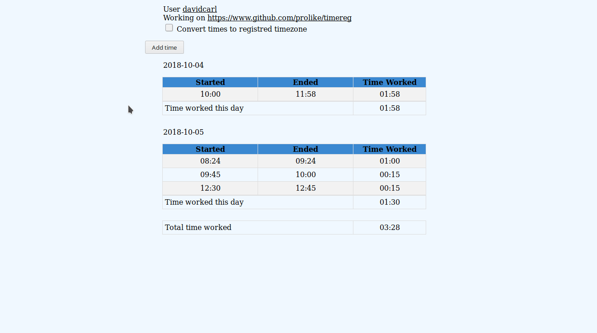

# Workflow

We expect you to either follow a special naming convention of branch or manually set the issue before every time start and end registration.

### Naming convention - CURRENTLY OUT OF ORDER

~~Your branches are supposed to be named with the issue number the branch refers to and then a dash afterwards e.g. `114-make-rawdata-subcommand` where `114` is the issue number. We use a tool called [git-phlow](https://github.com/Praqma/git-phlow) as part of our workflow but it isnt required.~~

### Manually set the issue number

If you dont like the branch to be named after the naming convention above it is still possible to use our tool. Instead you have to do `git git-mytest workon {issue number}` e.g. `workon 114`

### from a to z

When you start to work, the command is the following `git git-mytest workon {issue number}`. 

When you are done with your issue or need a pause from the issue, you will need to run the following command `git git-mytest wrapup`

Now you have made a time registration. A way to see what time you have registered and edit it if you made a mistake is to use the webreport we have made with the following command `git git-mytest webreport` in that you can click on the time registration you wan to edit. Like this

You can also see what you have logged directly in your console with the command `git git-mytest consolereport`